# The Wild Oasis

** A hotel management web app, where hotel employees can manage cabins, bookings, and guests. **

---

## Table of Contents

1. [About the Project](#about-the-project)
2. [Features](#features)
3. [Screenshots](#screenshots)
4. [Usage](#usage)
5. [License](#license)
6. [Contact](#contact)

---

## About the Project

The Wild Oasis is a hotel management web application designed to streamline the operations of hotel employees. It provides a user-friendly interface for managing cabins, bookings, and guests efficiently. The application allows hotel staff to easily add and update cabin information, manage guest bookings, and keep track of guest details. With its intuitive design and robust features, The Wild Oasis aims to enhance the overall management experience for hotel employees, ensuring smooth operations and improved customer service.

## Features

- **Cabin Management**: Add, update, and delete cabin information.
- **Booking Management**: Create, view, and manage guest bookings.
- **Guest Management**: Keep track of guest details and preferences.
- **User Authentication**: Secure login for hotel employees to access the management system.
- **Intuitive Interface**: User-friendly design for easy navigation and efficient management.

---

## Screenshots

### Login Page

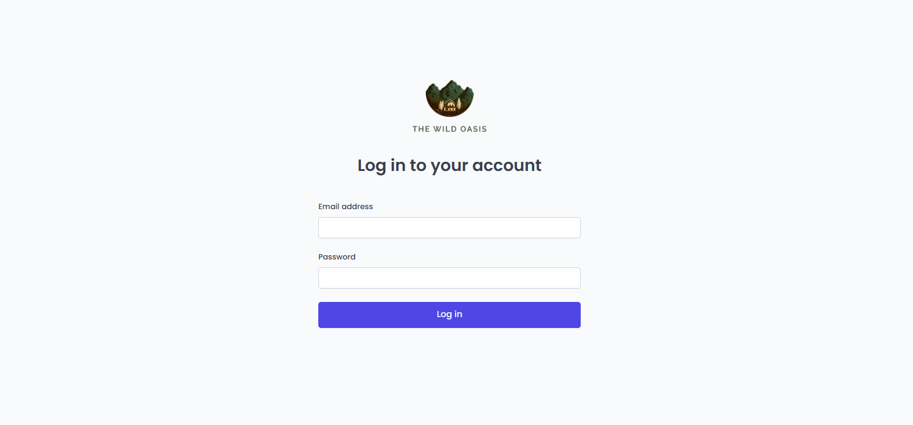

### Home Page / Dashboard

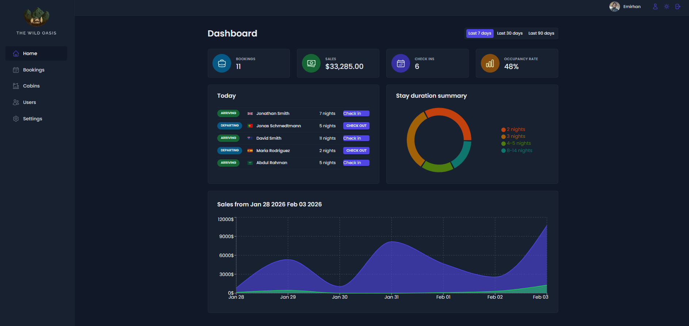

### Bookings Page

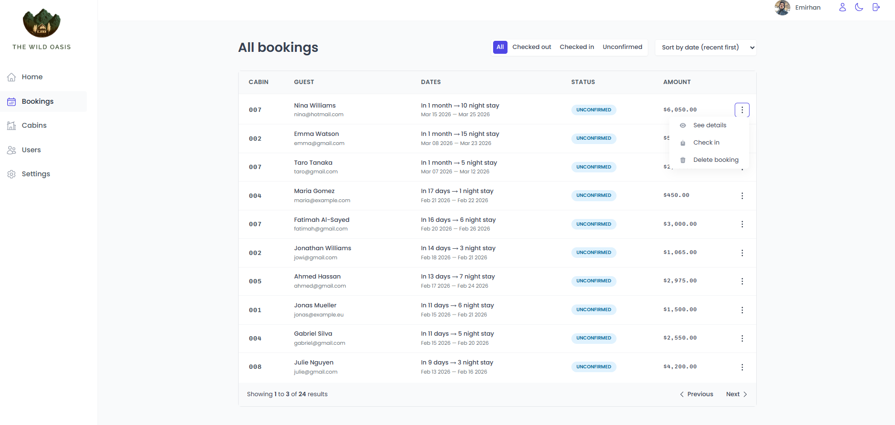

### Detailed Booking Page

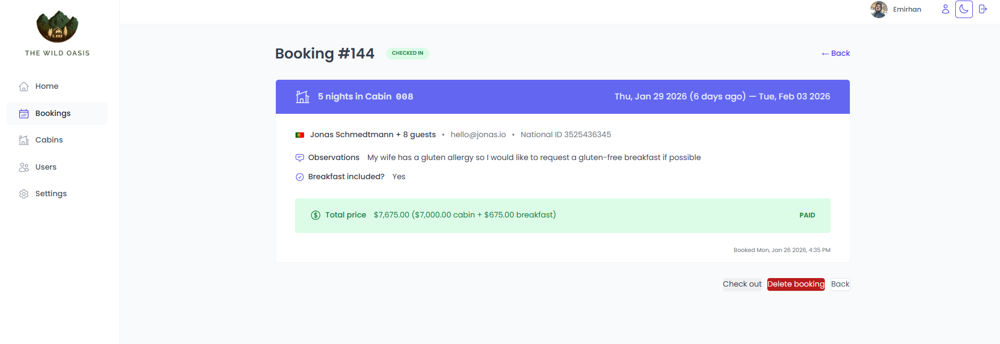

### Cabins Page

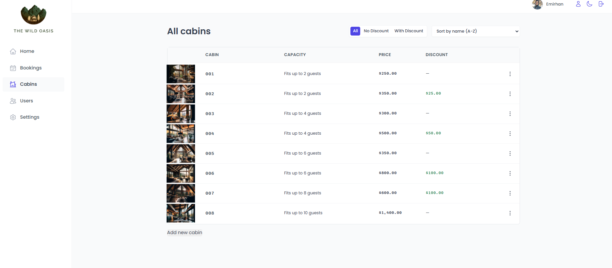

### Sorting and Filtering

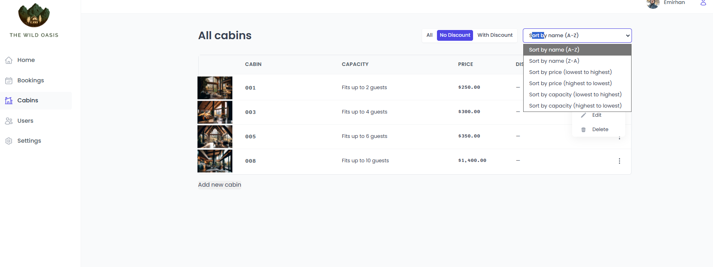

### Adding Cabin

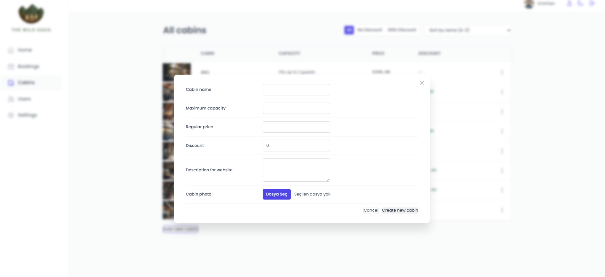

### Editing Cabin

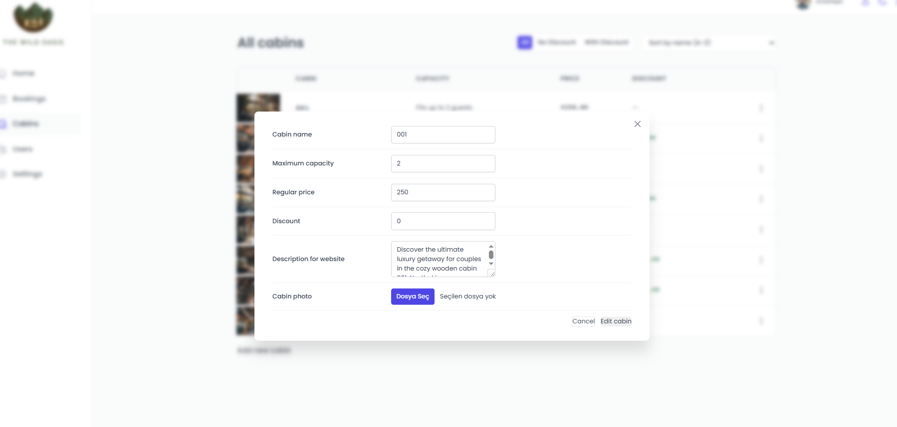

### Checkin Page

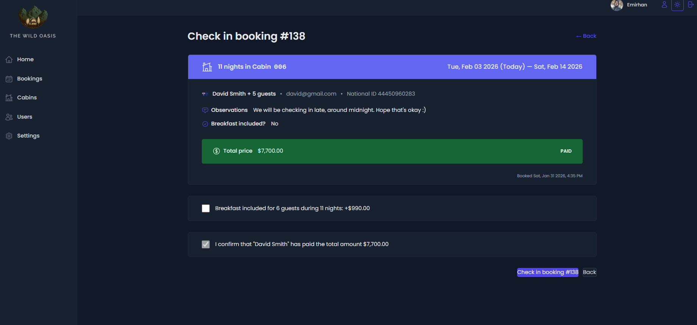

### Creating Users

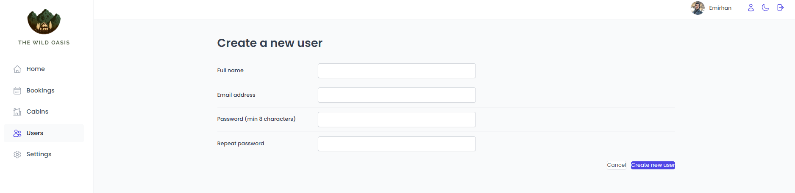

### Updating Users

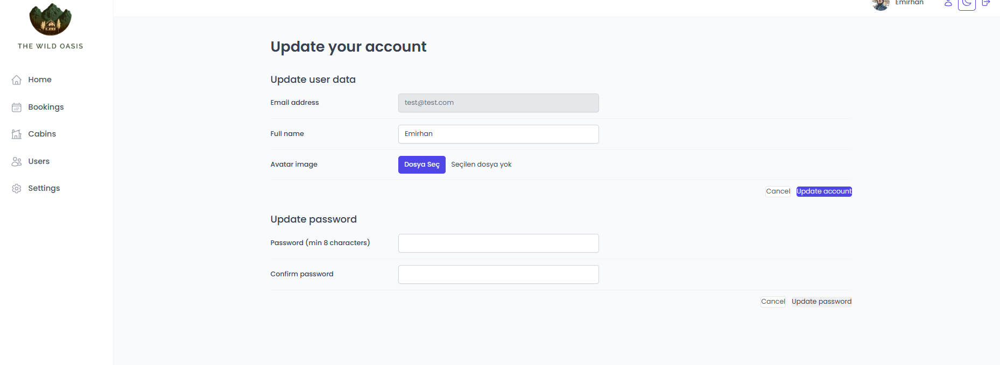

### Hotel Settings Page

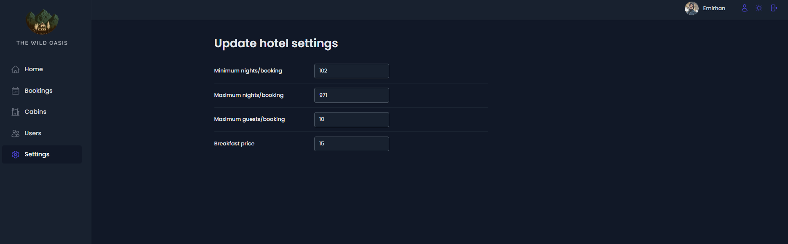

### Sending PDF Details

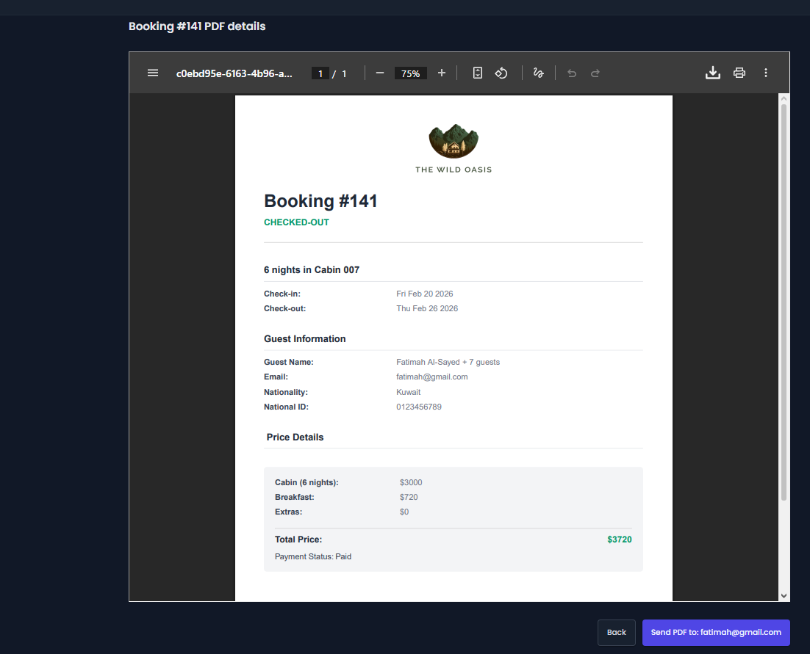

---

## Usage

1. **Log In**: For test purposes; email: test@test.com, password: 789456123.
2. **Navigate**: Use the sidebar to navigate through different sections (Cabins, Bookings, Guests, Settings).
3. **Manage Cabins**: Add new cabins, update existing ones, or delete cabins as needed.
4. **Manage Bookings**: Create new bookings, view existing bookings, and manage booking details.

---

## License

Distributed under the MIT License. See `LICENSE` for more information.

---

## Contact

Emirhan Karagöz - [emirhan-karagoz1@hotmail.com](mailto:emirhan-karagoz1@hotmail.com)

Project Link: [GitHub Repository](https://github.com/Wallinera/The-Wild-Oasis)

Live Site URL: [wildoasis.vercell.app](https://the-wild-oasis-umber-five.vercel.app)
